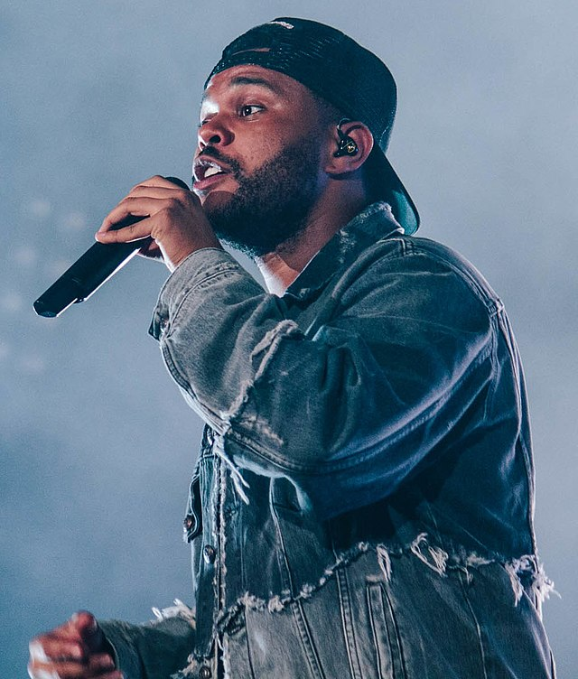

# programa-o3D
<section id="The Weeknd" class="my-5 pt-6 secao-tropicalia">
        

                

                        <h2>O que foi a The Weeknd?</h2>
                        
Abel Makkonen Tesfaye, mais conhecido por seu nome
                          artístico The Weeknd, é um cantor, compositor, ator e
                          produtor musical canadense. Conhecido por sua
                          versatilidade sonora e lirismo sombrio, suas músicas
                          exploram temas de escapismo, romance e melancolia, e
                          são frequentemente inspiradas em experiências pessoais Fonte: SiteWikipédia

                

        

</section>
<section id="inicio" class="my-5">
        

                

                        <h1 class="display-4 text-white fst-italic fw-bold">Boas-vindas a</h1>
                        
                        <a href="#the weeknd"
                                class="btn btn-primary btn-lg botao-inicio fw-semibold">Quero conhecer!</a>
                

                
            

</section>
<section id="tropicalia" class="my-5 pt-6 secao-tropicalia">
        

                

                        
                

                

                        <h2>O que foi a the weeknd?</h2>
                        
>Abel Makkonen Tesfaye, mais conhecido por seu nome
                          artístico The Weeknd, é um cantor, compositor, ator e
                          produtor musical canadense. Conhecido por sua
                          versatilidade sonora e lirismo sombrio, suas músicas
                          exploram temas de escapismo, romance e melancolia, e
                          são frequentemente inspiradas em experiências pessoais

                

        

</section>

<section id="galeria">
        <h2 class="text-center pt-5">Galeria</h2>
        

                

                        

                                
                        

                        

                                
                        

                

                

                        

                                
                        

                        

                                
                        

                

         

</section>
